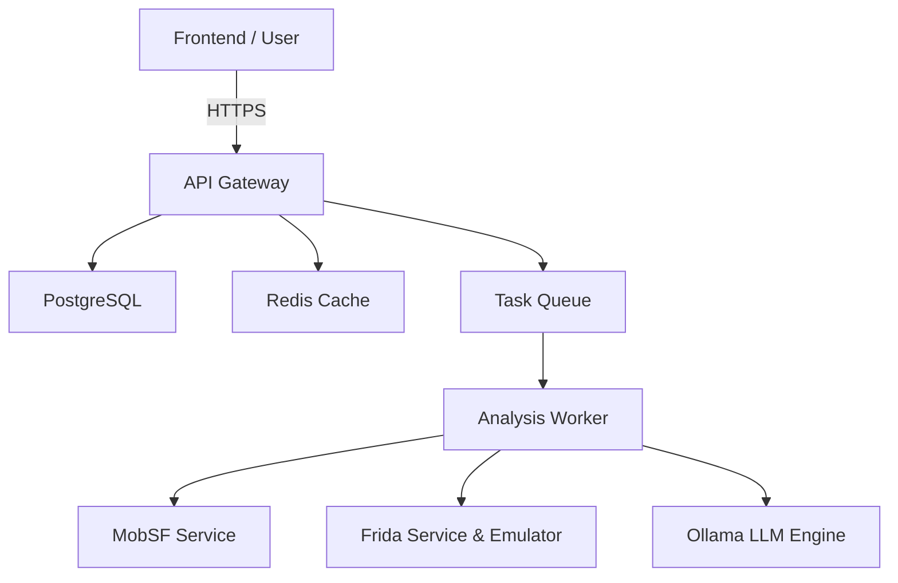
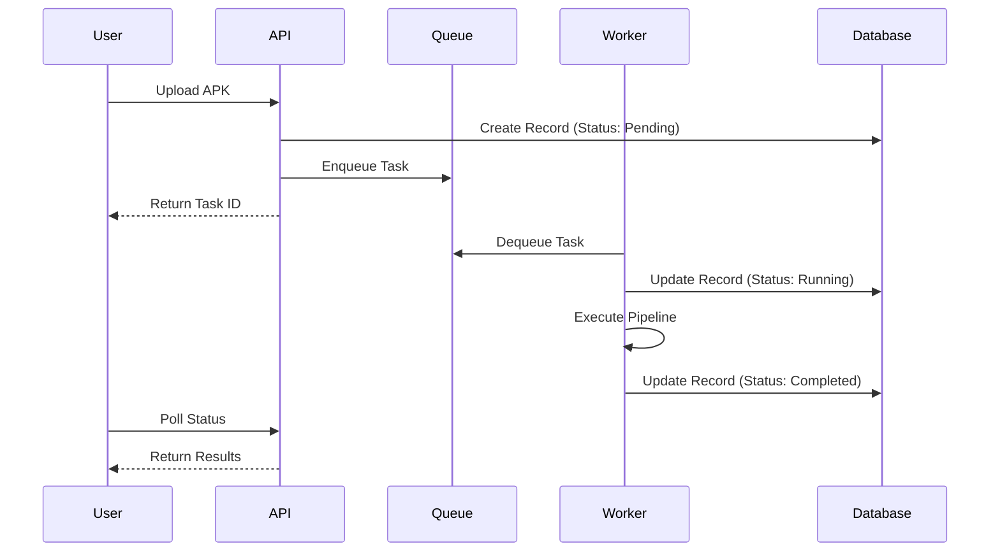
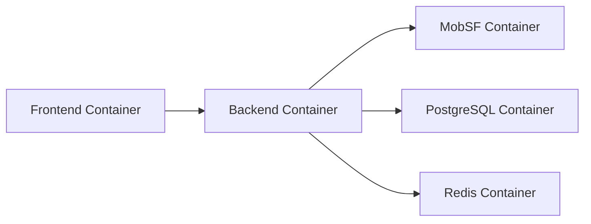

# Sudarshan: Architecture and Engineering Design Document

## 1. Executive Summary
Sudarshan is an enterprise-grade cybersecurity platform engineered to detect, analyze, and mitigate threats targeting mobile applications and APIs. By orchestrating a robust pipeline of static analysis, dynamic analysis, and advanced AI-driven reasoning, Sudarshan moves beyond traditional signature-based detection. This document serves as the comprehensive architectural blueprint for the platform, detailing the rationale behind design decisions, component interactions, data flows, and infrastructure configurations. 

## 2. System Vision
The vision for Sudarshan is to democratize advanced mobile threat intelligence. Security operations centers (SOCs) are overwhelmed with alert fatigue and obfuscated malware that easily bypass traditional heuristics. Sudarshan envisions a world where an AI Agent acts as a specialized reverse engineer—unpacking binaries, tracing code flows, hooking runtime methods, and returning plain-English explanations of malicious intent. It aims to be the single source of truth for mobile application risk assessment.

## 3. Design Philosophy
- **Modularity**: Every component (e.g., MobSF integration, Frida automation, LLM reasoning) must be decoupled.
- **Asynchronous Execution**: Mobile analysis takes time (decompilation, dynamic execution). The system must be fully asynchronous.
- **Privacy-First AI**: Leveraging local LLMs (Ollama) ensures that proprietary or sensitive decompiled code never leaves the corporate network.
- **Scalability**: Capable of processing hundreds of APKs concurrently via a microservices architecture.
- **Observability**: Every state change in the analysis pipeline must be logged, traced, and observable.

## 4. Requirements

### 4.1 Functional Requirements
- Accept APK uploads via REST API and a Web Dashboard.
- Perform static analysis by interfacing with MobSF.
- Perform dynamic analysis by injecting Frida scripts via ADB to an Android Emulator.
- Generate contextual insights using an LLM based on extracted code snippets.
- Aggregate all threat vectors into a unified Risk Score (0-100).
- Generate downloadable PDF and HTML security reports.
- Provide a real-time dashboard for analysts to monitor running tasks.

### 4.2 Non-Functional Requirements
- **Performance**: The API Gateway must handle 10,000 RPS. Upload endpoints must support files up to 200MB.
- **Latency**: Sub-50ms latency for dashboard rendering and API queries (excluding long-running analysis).
- **Availability**: 99.9% uptime for the API and frontend services.
- **Security**: All API communications must be authenticated. Sensitive data must be encrypted at rest.
- **Maintainability**: Strict adherence to SOLID principles, with a minimum of 80% test coverage.

## 5. Architecture Principles
1. **API-First**: All frontend and third-party interactions occur through documented RESTful APIs.
2. **Stateless Services**: The backend API servers maintain no local state, delegating state to Redis and PostgreSQL.
3. **Event-Driven Analysis**: The analysis pipeline operates as a state machine, emitting events upon the completion of each phase.
4. **Defense in Depth**: Zero-trust internal networking. Each container communicates only over necessary ports.

## 6. Repository Structure
The repository is flattened to ensure a clean separation of concerns:
- `backend/`: Core orchestration, AI logic, and API endpoints.
- `frontend/`: The presentation layer built on React.
- `docs/`: In-depth documentation.
- `docker/`: Container definitions and orchestration files.
- `scripts/`: Utilities for database migrations, setup, and teardown.
- `configs/`: Global environment configurations.
- `models/`: ML models and embedding databases.
- `tests/`: Integration and End-to-End testing.

## 7. Component Overview


## 8. Backend Architecture
The backend is built with FastAPI (Python) due to its native ASGI support, excellent validation (Pydantic), and high performance. It serves as the orchestrator, delegating heavy lifting to Celery workers. The backend follows a clear Controller-Service-Repository pattern.

## 9. Frontend Architecture
The frontend is a Single Page Application (SPA) built using React, Vite, and Tailwind CSS. It uses React Query for data fetching and state synchronization, ensuring the UI remains highly responsive even when querying massive analysis reports.

## 10. Authentication Flow
Sudarshan utilizes JSON Web Tokens (JWT) for authentication.
1. User submits credentials to `/api/v1/auth/login`.
2. Backend validates against PostgreSQL.
3. Backend issues an Access Token (15m expiry) and a Refresh Token (7d expiry).
4. The frontend stores tokens securely and attaches the Access Token as a Bearer header for subsequent requests.

## 11. API Gateway
While currently integrated within the FastAPI application, the routing layer acts as a pseudo-gateway—handling rate limiting, CORS, and request validation before passing data to the business logic layer. 

## 12. REST APIs
All APIs are versioned (e.g., `/api/v1/...`). Standard REST conventions apply. Responses follow a uniform structure:
```json
{
  "status": "success",
  "data": { ... },
  "message": "Operation completed."
}
```

## 13. Microservices
Sudarshan is designed to transition from a modular monolith to discrete microservices:
- **Core API**: Manages users, uploads, and metadata.
- **Analysis Engine**: Orchestrates the pipeline.
- **Intelligence Service**: Wraps Ollama and LangChain interactions.

## 14. Database Design
- **PostgreSQL**: Stores relational data: Users, Roles, Applications, Analysis Runs, Vulnerability Findings.
- **Redis**: Serves as the message broker for Celery and the caching layer for expensive DB queries.

## 15. Data Flow


## 16. Upload Pipeline
The upload pipeline buffers incoming APKs to disk, calculates SHA-256 hashes for deduplication, and extracts basic metadata (Package Name, Version) using `androguard` before queuing the file for deep analysis.

## 17. APK Processing
Before analysis, the APK is decompiled using APKTool to extract the `AndroidManifest.xml` and `smali` code. Dex2Jar/Jadx are used to convert DEX files into readable Java source code for the static analysis engine.

## 18. Static Analysis Pipeline
The static analysis pipeline scans the source code for:
- Hardcoded secrets and API keys.
- Insecure crypto implementations.
- Exposed exported activities/services.
- Dangerous permission requests.

## 19. Dynamic Analysis Pipeline
Dynamic analysis executes the app in a controlled environment to monitor its behavior. It tracks network requests, file system modifications, and cryptographic operations at runtime, detecting anomalies that static analysis misses.

## 20. MobSF Integration
Sudarshan leverages MobSF via its REST API. The worker uploads the APK to MobSF, triggers the scan, and polls for the JSON report. The raw MobSF report is then normalized into Sudarshan's standard finding format.

## 21. Frida Integration
Frida is used to instrument the app at runtime. Sudarshan dynamically generates JavaScript hooks based on the app's components, injecting them via the Frida-server running on the Android Emulator to intercept API calls and SSL pinning logic.

## 22. ADB Communication
The backend communicates with the Android Emulator via the Android Debug Bridge (ADB) over TCP (`host.docker.internal:5555`). This allows automated app installation, granting of permissions, and starting activities.

## 23. Ollama Integration
To provide contextual intelligence without compromising privacy, Sudarshan communicates with a local Ollama instance hosting models like Llama-3 or Mistral. All requests are sent via REST to the Ollama API on port 11434.

## 24. LLM Pipeline
The LLM pipeline ingests raw findings (e.g., "AES encryption with ECB mode detected"). It formats these findings, retrieves relevant context, and queries the LLM to generate an analyst-friendly explanation of the risk and exploitability.

## 25. Prompt Engineering
Prompts are carefully engineered using the System-User-Assistant structure. 
*System Prompt*: "You are an expert reverse engineer and mobile security researcher. Analyze the following code snippet and determine if it represents a malicious capability..."

## 26. RAG Architecture
Retrieval-Augmented Generation (RAG) is implemented to provide the LLM with specific context about known malware families.
1. Documents (threat reports) are embedded.
2. Findings trigger a similarity search.
3. Context is injected into the LLM prompt.

## 27. Knowledge Base
The Knowledge Base consists of Markdown files detailing known CVEs, MITRE ATT&CK for Mobile tactics, and malware signatures. This is the source material for the RAG architecture.

## 28. Embedding Strategy
Text chunks from the Knowledge Base are converted into dense vector embeddings using locally hosted embedding models (e.g., `all-MiniLM-L6-v2`) via HuggingFace `sentence-transformers`.

## 29. Vector Search
Embeddings are stored in a lightweight vector store (e.g., FAISS or ChromaDB). When a new vulnerability is found, the system performs a cosine similarity search to retrieve the top-K relevant threat intelligence documents.

## 30. AI Agents
Sudarshan utilizes LangChain to build autonomous agents. The "Triage Agent" can use tools (e.g., `search_manifest`, `decompile_class`) to autonomously investigate a suspicious finding without human intervention.

## 31. Risk Engine
The core mathematical model of Sudarshan. It consumes normalized findings from all pipelines and computes an aggregate score. 

## 32. Fraud Detection Engine
A specialized rule set targeting financial applications. It flags overlay attacks, accessibility service abuse, and SMS read permissions commonly used by banking trojans.

## 33. Malware Detection Engine
Integrates YARA rule scanning against the unpacked APK files and memory dumps obtained during dynamic analysis.

## 34. Rule Engine
A declarative YAML-based rule engine that allows security engineers to define custom heuristics (e.g., "IF permission=SMS AND network_request=http://... THEN flag=High").

## 35. Decision Engine
Resolves conflicting findings from different pipelines. If Static says "Safe" but Dynamic says "Malicious", the Decision Engine weighs the confidence scores and flags the anomaly for AI review.

## 36. Scoring Engine
Calculates the final Risk Score based on CVSS principles:
`Risk Score = (Base Impact * Exploitability) * Threat Context Modifier`

## 37. Workflow Engine
Manages the state transitions of the analysis job (Uploaded -> Unpacking -> Static -> Dynamic -> AI Review -> Completed). Implemented using Celery Canvas (Chains/Chords).

## 38. Report Generation
Aggregates the final database records into Jinja2 templates to produce HTML reports, which are subsequently converted to PDF using headless Chrome or WeasyPrint for executive distribution.

## 39. Logging
Structured JSON logging (using `structlog` in Python) ensures that all logs are easily parsed by ELK/Splunk stacks. Each log entry includes a `trace_id` for request tracking.

## 40. Observability
Prometheus metrics are exposed at `/metrics`, tracking API latencies, error rates, queue depths, and LLM inference times.

## 41. Error Handling
Global exception handlers in FastAPI catch unhandled exceptions, sanitize the error message (preventing stack trace leakage), and return standard HTTP 500 JSON responses while logging the critical failure internally.

## 42. Security Architecture
Sudarshan follows the Principle of Least Privilege. API endpoints are protected by RBAC (Role-Based Access Control). The database user has restricted permissions.

## 43. Secrets Management
No secrets are hardcoded. All sensitive data (API keys, DB passwords) are injected via the `.env` file or a secrets manager (e.g., HashiCorp Vault in production).

## 44. Rate Limiting
To prevent DoS, the API Gateway implements token-bucket rate limiting based on client IP and User ID (e.g., max 100 requests per minute).

## 45. Docker Architecture
The system uses Docker Compose for local orchestration. 


## 46. Networking
Docker networks isolate the components. The `frontend` only exposes port 5173. The `backend` exposes 8000. `MobSF` and databases are placed on an internal backend tier network, inaccessible from the host except via the API.

## 47. Container Communication
Service discovery relies on Docker's internal DNS. The backend connects to the database using the hostname `postgres` rather than an IP address.

## 48. Deployment Architecture
For production, Sudarshan is designed to be deployed on Kubernetes. Helm charts define the Deployments, Services, Ingress routes, and Persistent Volume Claims.

## 49. Development Environment
Local development relies on hot-reloading (`uvicorn --reload` and `vite dev`). Developers run databases via Docker while running code natively on the host machine for better debugging capabilities.

## 50. Production Environment
In production, the backend is served using Gunicorn with Uvicorn workers. The frontend is built into static files and served via NGINX. SSL termination happens at the load balancer.

## 51. Scaling Strategy
- **Frontend**: Scales infinitely via CDN (Cloudflare/AWS CloudFront).
- **Backend API**: Stateless, scales horizontally behind a load balancer.
- **Workers**: Auto-scales based on queue depth (e.g., KEDA in Kubernetes).
- **Database**: Primary-Replica setup for read-heavy operations.

## 52. Performance Optimizations
- Database indexes on frequently queried fields (`package_name`, `status`).
- Connection pooling using `asyncpg`.

## 53. Caching
Redis caches frequent, immutable queries (e.g., standard rule definitions, historical report summaries) to reduce database load.

## 54. Concurrency
FastAPI handles I/O bound concurrency seamlessly. CPU-bound tasks (hashing, encryption) are offloaded to ThreadPools.

## 55. Threading
Careful management of Python's GIL is maintained by utilizing `asyncio` for network calls (MobSF, Ollama) and multiprocess Celery workers for heavy computation.

## 56. Async Design
All internal HTTP requests to third-party services utilize `httpx` (async HTTP client) to prevent blocking the event loop.

## 57. Failure Recovery
Celery tasks are configured with exponential backoff retries. If MobSF is temporarily down, the task will retry 3 times before failing gracefully.

## 58. Disaster Recovery
Automated daily backups of the PostgreSQL database and Redis state to S3-compatible storage. Configured RPO (Recovery Point Objective) is 24 hours.

## 59. Future Improvements
- Migration to Rust for the heavy parsing engines to improve performance.
- Implementation of a GraphQL API for dynamic frontend querying.
- Cloud-native iOS app analysis capabilities.

## 60. Extension Points
The pipeline is designed using the Strategy Pattern. Adding a new analysis tool (e.g., QARK or AndroBugs) simply requires implementing the `BaseAnalyzer` interface and registering it in the workflow.

## 61. Developer Guidelines
Developers must use Type Hints in Python. Pre-commit hooks enforce `black` formatting and `flake8` linting.

## 62. Code Standards
Strict adherence to PEP-8 for Python and standard ESLint configurations for React. Code must be self-documenting with comprehensive docstrings.

## 63. Testing Strategy
- **Unit Tests**: `pytest` for backend, `Vitest` for frontend. Target 80% coverage.
- **Integration Tests**: Dockerized test environments verifying the flow from Upload -> Pipeline -> DB.
- **E2E Tests**: Cypress or Playwright to simulate user interactions on the dashboard.

## 64. CI/CD Design
GitHub Actions are triggered on every Push and PR. 
1. Run Linters.
2. Run Unit Tests.
3. Build Docker Images.
4. Push to Container Registry (on tag).

## 65. Release Strategy
Semantic Versioning (SemVer). Releases are tagged, and corresponding GitHub Releases are created with automated changelogs.

## 66. Maintenance Strategy
Dependencies are updated weekly via Dependabot. Security advisories are monitored continuously.

## 67. Glossary
- **APK**: Android Package Kit.
- **AST**: Abstract Syntax Tree.
- **RAG**: Retrieval-Augmented Generation.
- **LLM**: Large Language Model.
- **ADB**: Android Debug Bridge.

## 68. Appendix
Includes references to third-party documentation:
- [FastAPI Docs](https://fastapi.tiangolo.com/)
- [MobSF Docs](https://mobsf.github.io/docs/)
- [Frida Docs](https://frida.re/docs/home/)

---
*(End of Architecture Document)*
